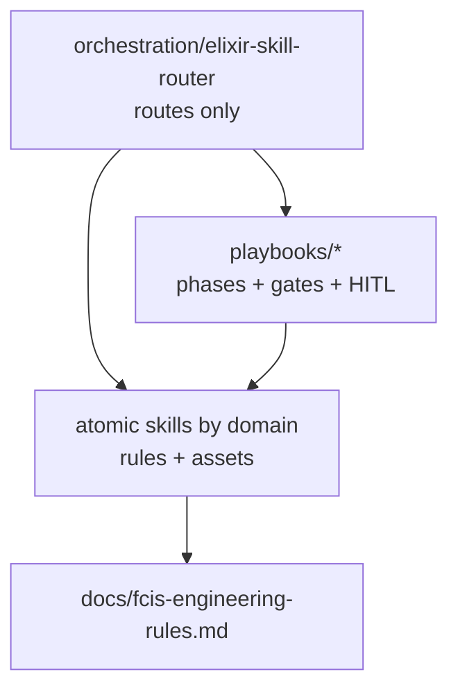
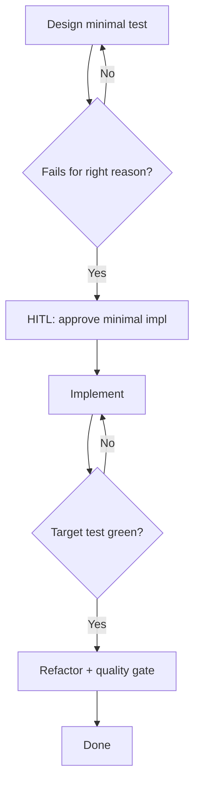

# Playbooks

Playbooks are **sequenced, multi-step workflows** with hard gates and human-in-the-loop (HITL) checkpoints. They orchestrate atomic skills; they do not re-teach domain rules.

## Playbooks vs orchestration vs atomics



| Kind | When to use |
|------|-------------|
| **Orchestrator** | “Where do I start?” / multi-concern triage |
| **Playbook** | Known process: TDD, bug fix, quality sweep, review, setup, … |
| **Atomic** | Implement or review one technical concern |

## Catalog (target)

| Playbook | Purpose | Loads (examples) |
|----------|---------|------------------|
| `tdd` | Red → HITL approve → green → refactor → quality gate | `testing-essentials`, `elixir-essentials` |
| `bug-fix` | Triage → failing repro → HITL fix → verify | `testing-essentials`, domain atomics |
| `quality` | Format / Credo / Dialyzer → refactor → docs | `code-quality`, `credo-config`, `refactor-code` |
| `code-review` | Structured review flow (Phase 5) | `quality/code-review` atomic |
| `setup` | Env → deps → DB → CI → validate | tooling / project atomics |
| `liveview` | Contract → failing LV test → thin edge impl | `phoenix-liveview-essentials`, `testing-essentials` |
| `background-job` | Design → TDD Oban worker → failure paths | `oban-essentials` |
| `ecto-migration` | Plan → migrate/rollback cycle → deploy notes | `ecto-essentials` |

Paths: `skills/playbooks/<name>/SKILL.md`.

## Required template

Every playbook `SKILL.md` must include:

1. **Frontmatter** — `type: playbook`, `tags: [playbooks]`, clear triggers in `description`
2. **When to use** — 3–5 lines
3. **Atomic skills this playbook loads** — concrete paths under the current taxonomy
4. **Phases** — numbered steps, commands, expected outputs
5. **HARD GATES** — stop conditions; no silent skip
6. **HUMAN-IN-THE-LOOP** — wait for explicit approval before implementation or destructive steps
7. **Verification checklist** — tickable, runnable
8. **Mermaid flowchart** — phases and gates
9. **Error recovery** — wrong-reason fail, red suite, gate fail
10. **Thin content** — orchestrate atomics; link FCIS doc; do not duplicate LiveView/Ecto textbooks

### Frontmatter sketch

```yaml
---
name: tdd
type: playbook
tags: [playbooks]
license: MIT
description: >
  Orchestrates the Elixir TDD cycle with hard gates and human approval before
  implementation. Trigger words: tdd, red-green-refactor, test first, failing test.
metadata:
  version: "1.0.0"
  user-invocable: "true"
  entry_point: true
  phases: [context, red, hitl-approve, green, refactor, quality-gate]
  hard_gates: [test-fails-right-reason, suite-green]
  dependencies:
    source: self
    skills:
      - testing-essentials
      - elixir-essentials
---
```

### HITL checkpoint wording

Use explicit stops, for example:

```text
HUMAN-IN-THE-LOOP — Implementation Proposal
Present the minimal change. Wait for explicit user approval before writing production code.
```

### Hard gate wording

```text
HARD GATE — Test Feedback
- Test exists and was run
- Fails for the correct reason (missing behavior), not syntax/config
If gate fails: fix the test, do not implement yet.
```

## Example flow: TDD



## Anti-patterns

| Anti-pattern | Do instead |
|--------------|------------|
| Re-teach Ecto inside a playbook | Link `skills/database/ecto-essentials` |
| Skip HITL “to go faster” | Stop and ask; playbooks assume human approval |
| Soft gates (“should run tests”) | Hard gate with command + expected outcome |
| Mixing router logic into playbooks | Keep routing in `orchestration/` |

## Related

- [taxonomy.md](taxonomy.md) — where playbooks live
- [fcis-engineering-rules.md](fcis-engineering-rules.md) — code shape atomics enforce
- Issue tracker: Phase 5 full playbook rewrite (#30); this doc is the **standard** (#27)
