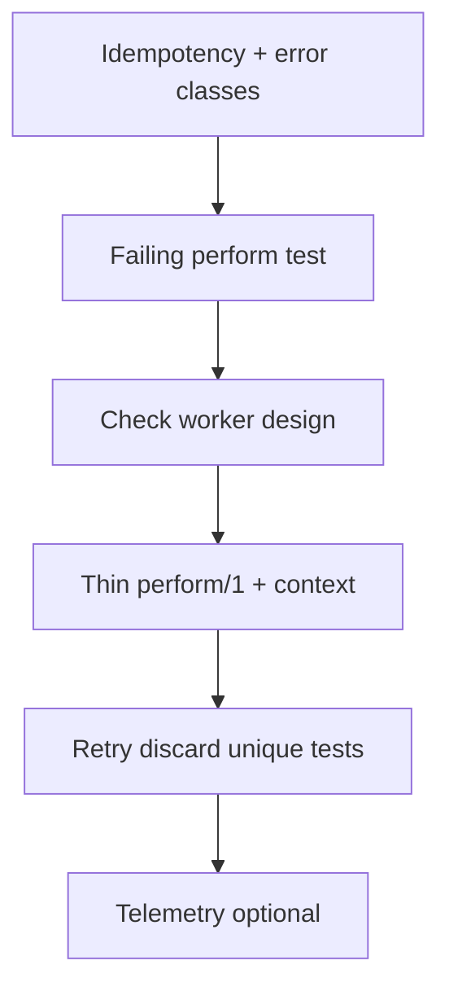

# Background Job Playbook

## HARD-GATE

- Idempotency key and error classification are documented before implementation.
- A failing worker test exists and fails for the right reason before `perform/1` is written.
- `perform/1` is a thin edge: fetch IDs → pure core → return tagged tuple.
- Failure paths are tested; the worker design matches authorized scope.
- `mix format --check-formatted`, `mix credo --strict`, and the full `mix test` suite are green before the PR is opened.

## When to use

Adding or hardening Oban (or similar) background workers.

## Atomic skills this playbook loads

| Skill | Path | Role |
|-------|------|------|
| `oban-essentials` | `skills/oban-essentials/` | Worker patterns |
| `testing-essentials` | `skills/testing-essentials/` | Oban.Testing |
| `elixir-essentials` | `skills/elixir-essentials/` | FCIS |
| `telemetry-essentials` | `skills/telemetry-essentials/` | Metrics |

## Flow



## Agent Phases

### Phase 1 — Design

Document: queue, args (IDs only), idempotency key, transient vs permanent errors.

**HARD GATE — Idempotency and error classification:**

- [ ] Queue, args (IDs only), idempotency key, and error classes are documented.
- [ ] Transient vs permanent errors are classified.

**If gate fails:** Revisit the design doc; do not write `perform/1` until the contract is clear.

### Phase 2 — RED

Worker test expecting success/cancel/error paths; must fail until implemented.

**HARD GATE — Failing worker test:**

- [ ] A worker test exists for success, cancel, and error paths.
- [ ] The test fails for the right reason before `perform/1` is written.

**If gate fails:** Adjust the test so it exercises missing behaviour, not a syntax/config mistake.

### Phase 3 — Implementation

1. Propose `perform/1` as edge: fetch → domain → tuple.
2. Verify that the worker design fits the authorized task; proceed within that scope.
3. Implement; enqueue from **context**, not LiveView.

**HARD GATE — Thin perform/1:**

- [ ] `perform/1` fetches IDs, delegates to a pure core/domain function, and returns a tagged tuple.
- [ ] Worker design matches the authorized task.
- [ ] Enqueue happens from context, not LiveView.

**If gate fails:** Extract logic into a context or pure function; verify the revised design stays within scope.

### Phase 4 — Failure paths

Cover: not found → cancel; transient → error/retry; duplicate → unique.

**HARD GATE — Failure paths tested:**

- [ ] `not_found` path returns `{:cancel, _}` or equivalent.
- [ ] Transient errors are retried; permanent errors are discarded.
- [ ] Duplicate jobs are handled via `unique` options or idempotency key.

**If gate fails:** Add missing tests and handling for each failure class.

### Phase 5 — Monitor

Attach telemetry/logging for failures if production-bound.

**HARD GATE — Authorized scope and green suite:**

- [ ] Final worker design satisfies the authorized acceptance criteria.
- [ ] `mix format --check-formatted`, `mix credo --strict`, and `mix test` pass.
- [ ] Telemetry/logging is attached for production failures.

**If gate fails:** Fix formatting, Credo, or test failures; resolve scope only if the change exceeds authorization.

## Verification checklist

- [ ] Idempotency plan
- [ ] Tests for success and failure classes
- [ ] Worker scope authorized
- [ ] No large payloads in args
- [ ] Enqueue from context

## Error Recovery

Non-idempotent side effects → add guards/unique; re-test double perform.

## Output Style

```markdown
## Background Job Report

**Design:** <queue, args, idempotency key, error classes>
**Test command:** `<mix test command>`
**HARD-GATE results:**
- Idempotency and error classification: PASS / FAIL
- Failing worker test: PASS / FAIL
- Thin perform/1: PASS / FAIL
- Failure paths tested: PASS / FAIL
- Authorized scope and green suite: PASS / FAIL
**Verdict:** APPROVE / REQUEST_CHANGES
```
