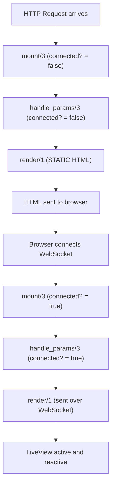

# Phoenix LiveView Essentials

<!-- Adapted from j-morgan6/elixir-phoenix-guide (MIT License, Copyright (c) 2026 Joseph Morgan) -->

Use this skill before writing ANY LiveView module or `.heex` template.

## RULES — Follow these with no exceptions

1. **Always add `@impl true`** before every callback (mount, handle_event, handle_info, render)
2. **Initialize assigns before they're accessed in render/1** — use mount/3 for static defaults, handle_params/3 for URL-dependent assigns (pagination, filters, sorting)
3. **Check `connected?(socket)`** before PubSub subscriptions, timers, or side effects
4. **Use `Map.get(assigns, :key, default)`** for optional assigns in helper functions
5. **Return proper tuples** — `{:ok, socket}` from mount, `{:noreply, socket}` from handle_event
6. **Use `with` for error handling** in event handlers — assign errors to socket, don't crash
7. **Never use `auto_upload: true` with form submission** — use manual uploads instead
8. **Check `core_components.ex` for existing components** before creating custom ones
9. **Never query the database directly from LiveViews** — call context functions instead
10. **Use streams for large collections** — see `liveview-streams` skill for details

---

## Critical Concept: Two-Phase Rendering

**LiveView renders happen in TWO phases:**

1. **Static/Disconnected Render** — Initial HTTP request; `connected?(socket)` is `false`; side effects won't work.
2. **Connected Render** — WebSocket established; `connected?(socket)` is `true`; events and live updates work.

**Common Bug:** Accessing uninitialized assigns during static render crashes with `KeyError`.

**Solution:** Initialize assigns before render — use mount/3 for static defaults, handle_params/3 for URL-dependent state.

---

## Lifecycle Flow



---

## Mount Callback

```elixir
@impl true
def mount(_params, _session, socket) do
  # Initialize static defaults here; URL-dependent assigns go in handle_params
  socket =
    socket
    |> assign(:user, nil)
    |> assign(:loading, false)
    |> assign(:data, [])

  # Only subscribe when connected — avoids double subscriptions across both render phases
  if connected?(socket) do
    Phoenix.PubSub.subscribe(MyApp.PubSub, "topic")
  end

  {:ok, socket}
end
```

**Defer expensive operations to the connected phase:**

```elixir
@impl true
def mount(_params, _session, socket) do
  socket =
    if connected?(socket) do
      assign(socket, :data, run_expensive_query())
    else
      assign(socket, :data, [])  # Placeholder for static render
    end

  {:ok, socket}
end
```

---

## Handle Event

```elixir
@impl true
def handle_event("save", %{"post" => post_params}, socket) do
  case Posts.create_post(post_params) do
    {:ok, post} ->
      socket =
        socket
        |> put_flash(:info, "Created!")
        |> assign(:post, post)

      {:noreply, socket}

    {:error, changeset} ->
      {:noreply, assign(socket, :changeset, changeset)}
  end
end

@impl true
def handle_event("delete", %{"id" => id}, socket) do
  Posts.delete_post(id)
  {:noreply, assign(socket, :posts, Posts.list_posts())}
end
```

---

## Handle Info

```elixir
@impl true
def handle_info({:post_created, post}, socket) do
  {:noreply, update(socket, :posts, fn posts -> [post | posts] end)}
end

@impl true
def handle_info(%{event: "presence_diff"}, socket) do
  {:noreply, assign(socket, :online_users, get_presence_count())}
end
```

---

## Handle Params

Respond to URL changes (called in BOTH render phases). Always initialize URL-dependent assigns here rather than in mount so they are available on both static and connected renders.

```elixir
@impl true
def handle_params(%{"id" => id}, _uri, socket) do
  post = Posts.get_post!(id)

  if connected?(socket) do
    Phoenix.PubSub.subscribe(MyApp.PubSub, "post:#{id}")
  end

  {:noreply, assign(socket, :post, post)}
end

@impl true
def handle_params(_params, _uri, socket) do
  {:noreply, socket}
end
```

---

## Socket Assigns

```elixir
# Single assign
socket = assign(socket, :count, 0)

# Multiple assigns
socket = assign(socket, count: 0, name: "User", active: true)

# Update existing assign
socket = update(socket, :count, &(&1 + 1))
```

✅ **In render/1:** Direct access is safe if initialized in mount.

```elixir
@impl true
def mount(_params, _session, socket) do
  {:ok, assign(socket, :count, 0)}
end

@impl true
def render(assigns) do
  ~H"""
  <p>Count: <%= @count %></p>
  """
end
```

✅ **In helper functions:** Use Map.get for optional assigns.

```elixir
defp format_user(socket) do
  case Map.get(socket.assigns, :current_user) do
    nil -> "Guest"
    user -> user.name
  end
end
```

---

## Live Navigation

```elixir
# Full page reload (new LiveView)
{:noreply, push_navigate(socket, to: ~p"/users")}

# Patch (same LiveView, different params)
{:noreply, push_patch(socket, to: ~p"/posts/#{post}")}
```

---

## Components

```elixir
def card(assigns) do
  ~H"""
  <div class="card">
    <h3><%= @title %></h3>
    <p><%= @content %></p>
  </div>
  """
end

# Usage in template
# <.card title="Hello" content="World" />
```

---

## Form Binding

```heex
<.simple_form for={@form} phx-change="validate" phx-submit="save">
  <.input field={@form[:title]} label="Title" />
  <.input field={@form[:body]} type="textarea" label="Body" />
  <:actions>
    <.button>Save</.button>
  </:actions>
</.simple_form>
```

```elixir
@impl true
def mount(_params, _session, socket) do
  changeset = Post.changeset(%Post{}, %{})
  {:ok, assign(socket, form: to_form(changeset))}
end

@impl true
def handle_event("validate", %{"post" => params}, socket) do
  changeset =
    %Post{}
    |> Post.changeset(params)
    |> Map.put(:action, :validate)

  {:noreply, assign(socket, form: to_form(changeset))}
end
```

---

## Error Handling

```elixir
@impl true
def handle_event("save", params, socket) do
  case save_record(params) do
    {:ok, record} ->
      socket =
        socket
        |> put_flash(:info, "Saved successfully")
        |> assign(:record, record)

      {:noreply, socket}

    {:error, %Ecto.Changeset{} = changeset} ->
      socket =
        socket
        |> put_flash(:error, "Please correct the errors")
        |> assign(:changeset, changeset)

      {:noreply, socket}

    {:error, reason} ->
      socket = put_flash(socket, :error, "An error occurred: #{reason}")
      {:noreply, socket}
  end
end
```

---

## Integration

| Predecessor | This Skill | Successor |
|-------------|------------|-----------|
| elixir-essentials | phoenix-liveview-essentials | testing-essentials |
| None (standalone) | phoenix-liveview-essentials | liveview-streams |
| None (standalone) | phoenix-liveview-essentials | phoenix-scopes |
| None (standalone) | phoenix-liveview-essentials | phoenix-pubsub-patterns |
| None (standalone) | phoenix-liveview-essentials | phoenix-liveview-auth |
| **ecto-essentials** | When working with database operations | |

See `agents/liveview-checklist.md` for a step-by-step LiveView development checklist.
