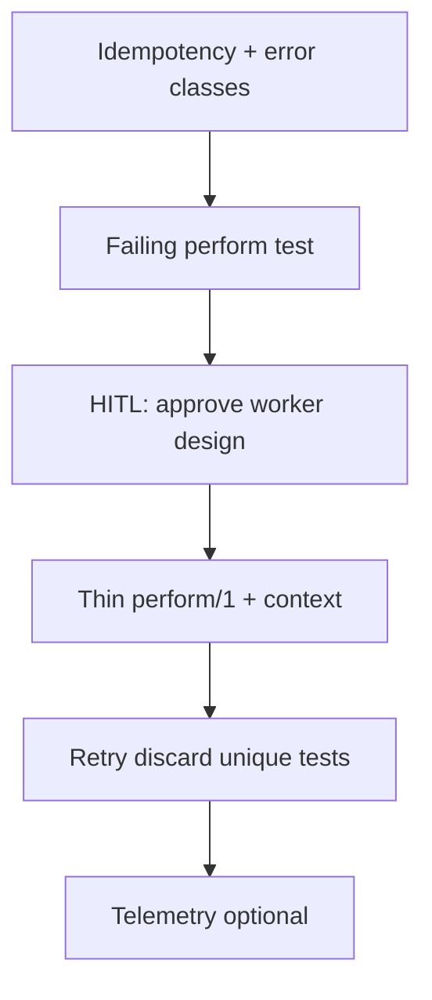

# Background Job Playbook

## HARD-GATE

- Idempotency key and error classification are documented before implementation.
- A failing worker test exists and fails for the right reason before `perform/1` is written.
- `perform/1` is a thin edge: fetch IDs → pure core → return tagged tuple.
- Failure paths are tested; user approves the worker design.

## When to use

Adding or hardening Oban (or similar) background workers.

## Atomic skills this playbook loads

| Skill | Path | Role |
|-------|------|------|
| `oban-essentials` | `skills/infrastructure/oban-essentials/` | Worker patterns |
| `testing-essentials` | `skills/testing/testing-essentials/` | Oban.Testing |
| `elixir-essentials` | `skills/elixir-core/elixir-essentials/` | FCIS |
| `telemetry-essentials` | `skills/performance/telemetry-essentials/` | Metrics |

## Flow

## Phases

### Phase 1 — Design

Document: queue, args (IDs only), idempotency key, transient vs permanent errors.

**HARD GATE — Design:** idempotency + error classification written down.

### Phase 2 — RED

Worker test expecting success/cancel/error paths; must fail until implemented.

### Phase 3 — HITL impl

1. Propose `perform/1` as edge: fetch → domain → tuple.
2. **HUMAN-IN-THE-LOOP:** approve.
3. Implement; enqueue from **context**, not LiveView.

### Phase 4 — Failure paths

Cover: not found → cancel; transient → error/retry; duplicate → unique.

### Phase 5 — Monitor

Attach telemetry/logging for failures if production-bound.

## Verification checklist

- [ ] Idempotency plan
- [ ] Tests for success and failure classes
- [ ] HITL approval
- [ ] No large payloads in args
- [ ] Enqueue from context

## Error Recovery

Non-idempotent side effects → add guards/unique; re-test double perform.

## Output Style

Design table, test list, gate status.
