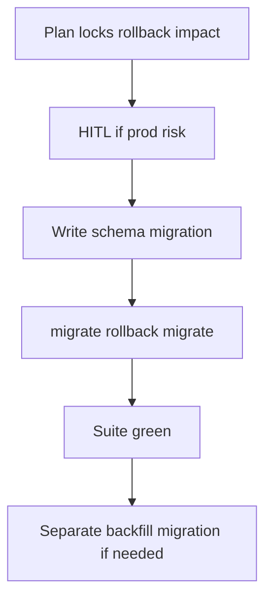

# Ecto Migration Playbook

## HARD-GATE

- A migration plan and rollback story are documented before any migration is written.
- Schema changes and data backfill are never combined in the same migration.
- The `mix ecto.migrate` → `mix ecto.rollback` → `mix ecto.migrate` cycle must succeed.
- Tests must be green and HITL approval obtained for production-impacting locks.

## When to use

Any schema change: tables, columns, indexes, constraints.

## Atomic skills this playbook loads

| Skill | Path | Role |
|-------|------|------|
| `ecto-essentials` | `skills/database/ecto-essentials/` | Migrations/schemas |
| `apply-ecto-conventions` | `skills/database/apply-ecto-conventions/` | Repo/query conventions |

## Flow



## Phases

### Phase 1 — Plan

Assess: lock risk, expand-contract need, rollback strategy, index concurrency.

**HUMAN-IN-THE-LOOP:** for production-impacting locks or multi-step expand-contract, present plan and wait for approval.

**HARD GATE — Plan:** rollback story documented.

### Phase 2 — Implement

- Schema change **or** data backfill — **never both** in one migration
- Indexes on FKs; reversible `change/0` when possible

### Phase 3 — Migrate cycle

```bash
mix ecto.migrate
mix ecto.rollback
mix ecto.migrate
```

**HARD GATE:** cycle succeeds.

### Phase 4 — Verify

```bash
mix test
```

Update schemas/typespecs if columns changed.

## Verification checklist

- [ ] Plan + rollback noted
- [ ] No combined schema+backfill
- [ ] migrate/rollback/migrate OK
- [ ] Tests green
- [ ] HITL for high-risk prod steps

## Error Recovery

Irreversible migration → stop; write compensating migration; do not force production.

## Output Style

Plan summary, migration paths, command results.
