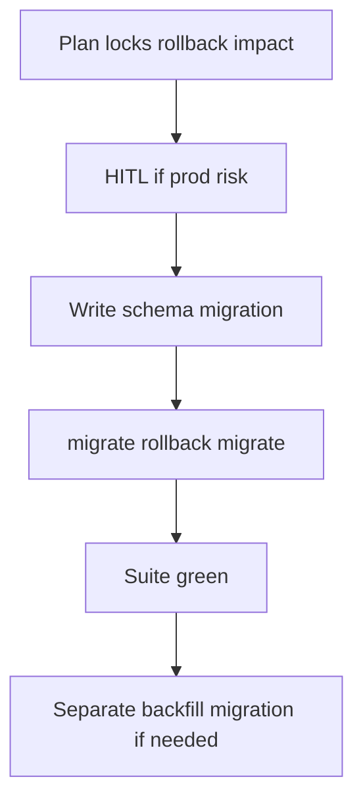

# Ecto Migration Playbook

## HARD-GATE

- A migration plan and rollback story are documented before any migration is written.
- Schema changes and data backfill are never combined in the same migration.
- A test that depends on the new schema/constraint fails before the migration is applied and passes after.
- The `mix ecto.migrate` → `mix ecto.rollback` → `mix ecto.migrate` cycle must succeed.
- `mix format --check-formatted`, `mix credo --strict`, and the full `mix test` suite are green.
- HITL approval is obtained for production-impacting locks.

## When to use

Any schema change: tables, columns, indexes, constraints.

## Atomic skills this playbook loads

| Skill | Path | Role |
|-------|------|------|
| `ecto-essentials` | `skills/database/ecto-essentials/` | Migrations/schemas |
| `apply-ecto-conventions` | `skills/database/apply-ecto-conventions/` | Repo/query conventions |

## Flow



## Agent Phases

### Phase 1 — Plan

Assess: lock risk, expand-contract need, rollback strategy, index concurrency.

**HUMAN-IN-THE-LOOP:** for production-impacting locks or multi-step expand-contract, present plan and wait for approval.

**HARD GATE — Plan and rollback documented:**

- [ ] Lock risk and index concurrency are assessed.
- [ ] Rollback strategy is documented.
- [ ] For production-impacting locks, HITL approval is obtained.

**If gate fails:** Re-document the plan and rollback; do not write the migration until the plan is approved.

### Phase 2 — Implement

- Schema change **or** data backfill — **never both** in one migration
- Indexes on FKs; reversible `change/0` when possible

**HARD GATE — No combined schema and data migrations:**

- [ ] The migration changes schema **or** performs a data backfill, not both.
- [ ] Indexes are added on foreign keys.
- [ ] `change/0` is reversible or separate `up`/`down` functions are provided.

**If gate fails:** Split the migration into a schema migration and a separate backfill migration.

### Phase 3 — Migrate cycle

```bash
mix ecto.migrate
mix ecto.rollback
mix ecto.migrate
```

**HARD GATE — Migrate-rollback-migrate cycle green:**

- [ ] `mix ecto.migrate` → `mix ecto.rollback` → `mix ecto.migrate` succeeds.

**If gate fails:** Fix the migration reversibility before proceeding.

### Phase 4 — Verify

```bash
mix test
```

Update schemas/typespecs if columns changed.

**HARD GATE — Format Credo and full suite green:**

- [ ] A test that depends on the new schema/constraint failed before the migration and passes after.
- [ ] `mix test`, `mix format --check-formatted`, and `mix credo --strict` pass.
- [ ] Schemas and typespecs are updated if columns changed.

**If gate fails:** Update schemas/typespecs, fix formatting, Credo, or test failures.

## Verification checklist

- [ ] Plan + rollback noted
- [ ] No combined schema+backfill
- [ ] migrate/rollback/migrate OK
- [ ] Tests green
- [ ] HITL for high-risk prod steps

## Error Recovery

Irreversible migration → stop; write compensating migration; do not force production.

## Output Style

```markdown
## Ecto Migration Report

**Plan:** <lock risk, rollback strategy, HITL status>
**Migration:** `<migration filename>`
**HARD-GATE results:**
- Plan and rollback documented: PASS / FAIL
- No combined schema and data migrations: PASS / FAIL
- Migrate-rollback-migrate cycle green: PASS / FAIL
- Format Credo and full suite green: PASS / FAIL
**Command results:**
- `mix ecto.migrate`: exit 0 / non-zero
- `mix ecto.rollback`: exit 0 / non-zero
- `mix test`: exit 0 / non-zero
**Verdict:** APPROVE / REQUEST_CHANGES
```
