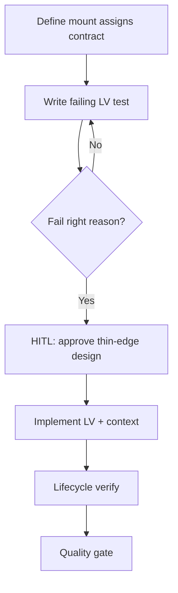

# LiveView Playbook

## HARD-GATE

- A LiveView contract and failing `live/2` or `live_isolated` test must exist before implementation.
- The test must fail because behaviour is missing, not due to config/syntax.
- `handle_event/3` and `handle_info/2` remain thin; no `Repo` calls inside LiveViews.
- Implementation requires explicit user approval; full suite and Credo/format must pass.

## When to use

New LiveView pages/features or substantial LiveView behaviour changes.

## Atomic skills this playbook loads

| Skill | Path | Role |
|-------|------|------|
| `phoenix-liveview-essentials` | `skills/phoenix/phoenix-liveview-essentials/` | Lifecycle, assigns |
| `apply-phoenix-liveview-conventions` | `skills/phoenix/apply-phoenix-liveview-conventions/` | Conventions |
| `testing-essentials` | `skills/testing/testing-essentials/` | LV tests |
| `elixir-essentials` | `skills/elixir-core/elixir-essentials/` | FCIS thin edges |
| `liveview-streams` | `skills/phoenix/liveview-streams/` | Large collections |

## Flow

## Phases

### Phase 1 — Contract

Document assigns shape, events, and which work lives in **context/pure modules** vs LiveView.

### Phase 2 — RED

Write `live/2` or `live_isolated` test; run until fail is “missing behaviour”.

**HARD GATE — Test Feedback**

### Phase 3 — HITL impl

1. Propose thin `handle_event` → context design (no Repo in LiveView).
2. **HUMAN-IN-THE-LOOP:** wait for approval.
3. Implement; keep callbacks thin (FCIS).

### Phase 4 — Verify

- Mount → render → event → update path green
- `connected?` for side effects; streams for large lists

### Phase 5 — Quality

`mix test`, format, credo; no assigns bloat.

## Verification checklist

- [ ] Contract written
- [ ] Failing test first
- [ ] Approval before impl
- [ ] No Repo/business soup in LiveView
- [ ] Tests green

## Error Recovery

Fat LiveView after impl → extract pure/context module; re-test.

## Output Style

Contract summary, test command, gate status.
