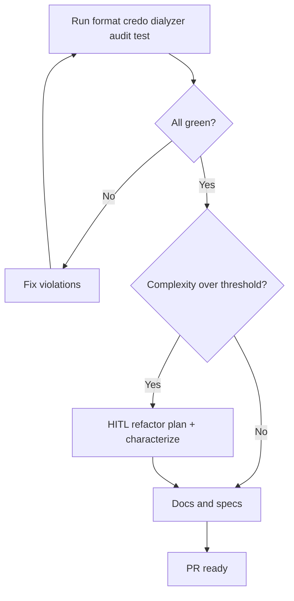

# Quality Playbook

## HARD-GATE

- All quality commands (`mix format --check-formatted`, `mix credo --strict`, `mix dialyzer`, `mix hex.audit`, `mix test`) must exit 0 before a PR is opened.
- Any refactor requires green characterization tests and explicit user approval.
- No gate may be skipped or declared green from simulated output.

## When to use

Before opening a PR or when asked for a full quality/production-readiness pass.

## Atomic skills this playbook loads

| Skill | Path | Role |
|-------|------|------|
| `code-quality` | `skills/quality/code-quality/` | Complexity/duplication |
| `credo-config` | `skills/quality/credo-config/` | Credo setup |
| `refactor-code` | `skills/quality/refactor-code/` | Safe extractions |
| `typespec-dialyzer` | `skills/elixir-core/typespec-dialyzer/` | Specs/docs types |

## Flow



## Complexity thresholds (Phase 2 trigger)

| Metric | Threshold |
|--------|-----------|
| Function length | > 20 lines |
| Parameters | > 4 |
| Module length | > 400 lines |
| Nesting | > 3 |
| Pipe chain | > 5 |

## Phases

### Phase 1 — Conventions

```bash
mix format --check-formatted
mix credo --strict
mix dialyzer
mix hex.audit
mix test
```

**HARD GATE:** all commands exit 0 before Phase 2/PR.

### Phase 2 — Refactor (optional)

Only if thresholds exceeded.

1. Characterization test (must be green on current code).
2. **HUMAN-IN-THE-LOOP:** propose one extraction at a time; wait for approval.
3. Apply one change; re-run tests.
4. Prefer FCIS extractions (pure modules out of LiveViews/controllers/workers).

**If red:** revert last change; smaller step.

### Phase 3 — Documentation

- `@doc` + `@spec` on public APIs touched
- No PR until docs + Phase 1 gate hold

## Verification checklist

- [ ] Format / Credo / Dialyzer / audit / test green
- [ ] Refactors (if any) HITL-approved and characterized
- [ ] Public APIs documented
- [ ] No FCIS violations introduced (fat edges)

## Error Recovery

Fix failing tool first; never open PR with a red gate.

## Output Style

Command results table, refactor list, docs remaining.
