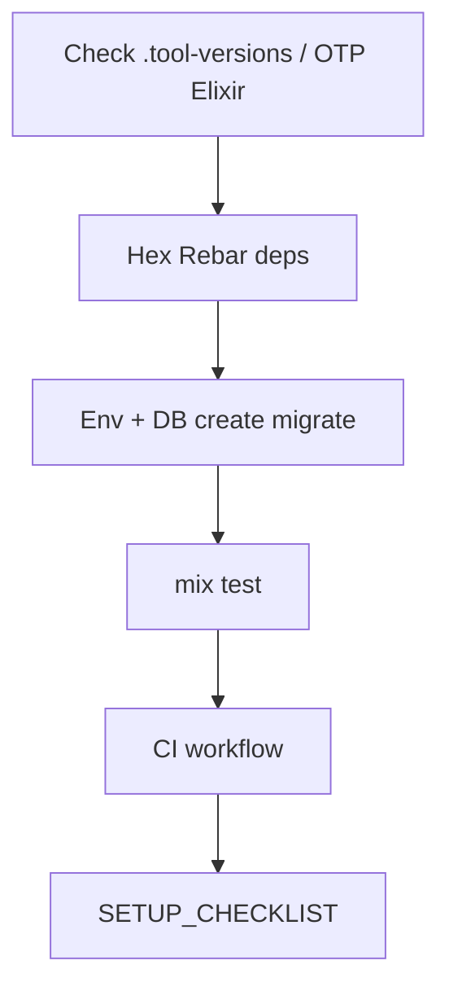

# Setup Playbook

## HARD-GATE

- Elixir/Erlang/OTP versions must match `.tool-versions` / `.elixir-version`.
- `mix deps.get`, `mix ecto.create`, `mix ecto.migrate`, and `mix test` must succeed locally before CI is considered valid.
- No secrets, tokens, or environment-specific URLs are committed.
- CI workflow is defined and covers `mix format --check-formatted`, `mix credo --strict`, and `mix test` (plus `mix dialyzer` if the project uses it).

## When to use

New machine, new Phoenix app bootstrap, or repairing a broken local/CI environment.

## Atomic skills this playbook loads

| Skill | Path | Role |
|-------|------|------|
| `mix-tasks-generators` | `skills/tooling/mix-tasks-generators/` | Mix/generators |
| `deployment-gotchas` | `skills/infrastructure/deployment-gotchas/` | Runtime config |
| `testing-essentials` | `skills/testing/testing-essentials/` | Suite expectations |

## Flow



## Agent Phases

### Phase 1 — Toolchain

1. Confirm Elixir/Erlang match `.tool-versions` / `.elixir-version`.
2. `mix local.hex --force` / `mix local.rebar --force` as needed.
3. Copy `.env.example` → `.env` (never commit secrets).

**HARD GATE — Versions match tool files:**

- [ ] Elixir/Erlang/OTP versions match `.tool-versions` / `.elixir-version`.
- [ ] `mix local.hex` and `mix local.rebar` are installed.

**If gate fails:** Install the correct versions via `asdf`/`mise`/`.tool-versions` before continuing.

### Phase 2 — App boot

```bash
mix deps.get
mix ecto.create
mix ecto.migrate
mix test
```

**HUMAN-IN-THE-LOOP:** before `ecto.drop`, production-like DB reset, or force-push — wait for approval.

**HARD GATE — Local setup succeeds:**

- [ ] `mix deps.get`, `mix ecto.create`, `mix ecto.migrate`, and `mix test` succeed locally.

**If gate fails:** Resolve dependency, database, or test failures; document only redacted connection details.

### Phase 3 — CI

Ensure CI runs format, credo, test (and dialyzer if project uses it). Pin actions by SHA when editing workflows.

**HARD GATE — CI defined:**

- [ ] CI workflow is committed and covers `mix format --check-formatted`, `mix credo --strict`, and `mix test` (plus `mix dialyzer` if used).
- [ ] Actions are pinned by SHA.

**If gate fails:** Add or update the workflow and pin actions before declaring setup complete.

### Phase 4 — Validate

Write/update `SETUP_CHECKLIST.md` with commands that worked.

**HARD GATE — No secrets committed:**

- [ ] No secrets, tokens, or environment-specific URLs are committed.
- [ ] `DATABASE_URL` or credentials are documented only in redacted form.

**If gate fails:** Remove the secret, rotate it if exposed, and add it to `.gitignore` or vault.

## Verification checklist

- [ ] Tool versions verified
- [ ] Deps + migrate + test succeed
- [ ] CI covers quality gates
- [ ] No secrets committed

## Error Recovery

Port/DB conflicts: document only a redacted `DATABASE_URL` or non-sensitive connection details; never commit a credential-bearing URL.

## Output Style

```markdown
## Setup Report

**Machine:** `<hostname>`
**Elixir/Erlang/OTP:** `<versions>`
**HARD-GATE results:**
- Versions match tool files: PASS / FAIL
- Local setup succeeds: PASS / FAIL
- CI defined: PASS / FAIL
- No secrets committed: PASS / FAIL

**Commands run:**
| Command | Exit | Notes |
|---------|------|-------|
| `mix deps.get` | 0 / non-zero | |
| `mix ecto.create` | 0 / non-zero | |
| `mix ecto.migrate` | 0 / non-zero | |
| `mix test` | 0 / non-zero | |

**Verdict:** APPROVE / REQUEST_CHANGES
```
