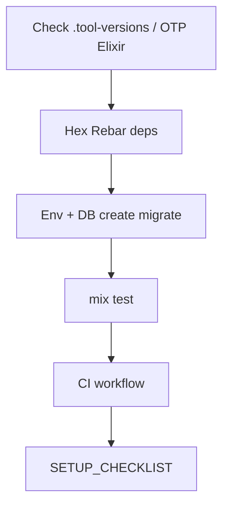

# Setup Playbook

## HARD-GATE

- Elixir/Erlang/OTP versions must match `.tool-versions` / `.elixir-version`.
- `mix deps.get`, `mix ecto.create`, `mix ecto.migrate`, and `mix test` must succeed locally before CI is considered valid.
- No secrets, tokens, or environment-specific URLs are committed.

## When to use

New machine, new Phoenix app bootstrap, or repairing a broken local/CI environment.

## Atomic skills this playbook loads

| Skill | Path | Role |
|-------|------|------|
| `mix-tasks-generators` | `skills/tooling/mix-tasks-generators/` | Mix/generators |
| `deployment-gotchas` | `skills/infrastructure/deployment-gotchas/` | Runtime config |
| `testing-essentials` | `skills/testing/testing-essentials/` | Suite expectations |

## Flow



## Phases

### Phase 1 — Toolchain

1. Confirm Elixir/Erlang match `.tool-versions` / `.elixir-version`.
2. `mix local.hex --force` / `mix local.rebar --force` as needed.
3. Copy `.env.example` → `.env` (never commit secrets).

**HARD GATE:** versions match project files.

### Phase 2 — App boot

```bash
mix deps.get
mix ecto.create
mix ecto.migrate
mix test
```

**HUMAN-IN-THE-LOOP:** before `ecto.drop`, production-like DB reset, or force-push — wait for approval.

**HARD GATE:** DB connects; `mix test` green (or document known failures).

### Phase 3 — CI

Ensure CI runs format, credo, test (and dialyzer if project uses it). Pin actions by SHA when editing workflows.

### Phase 4 — Validate

Write/update `SETUP_CHECKLIST.md` with commands that worked.

## Verification checklist

- [ ] Tool versions verified
- [ ] Deps + migrate + test succeed
- [ ] CI covers quality gates
- [ ] No secrets committed

## Error Recovery

Port/DB conflicts: document actual `DATABASE_URL`; do not invent credentials.

## Output Style

Checklist of commands with exit status.
