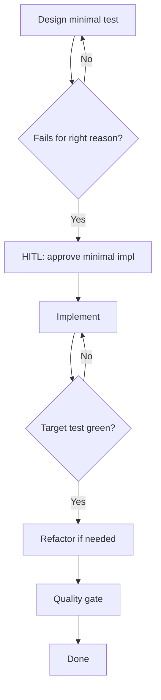

# TDD Playbook

## HARD-GATE

- No implementation code is written until a test exists, is run, and fails for the right reason (missing behaviour, not syntax/config).
- Implementation requires explicit user approval.
- The quality gate (`mix format --check-formatted`, `mix credo --strict`, `mix dialyzer`, `mix test`) must pass before opening a PR.

## When to use

Building or changing Elixir behaviour where tests must gate implementation. Prefer pure-core unit tests first (FCIS); use DataCase only when persistence is the behaviour under test.

## Atomic skills this playbook loads

| Skill | Path | Role |
|-------|------|------|
| `testing-essentials` | `skills/testing/testing-essentials/` | ExUnit patterns, fixtures |
| `elixir-essentials` | `skills/elixir-core/elixir-essentials/` | FCIS language rules |
| `typespec-dialyzer` | `skills/elixir-core/typespec-dialyzer/` | `@spec` on public APIs |

Do **not** re-teach LiveView/Ecto here — load domain atomics when the feature needs them.

## Flow



## Phases

### Phase 1 — Context & RED

1. Decide test type (unit / DataCase / LiveView) and boundary.
2. Write the **minimal** failing test.
3. Run: `mix test path/to/file_test.exs`

**HARD GATE — Test Feedback**

- Test exists and was run
- Fails because behaviour is missing (e.g. `UndefinedFunctionError`), not syntax/config

**If gate fails:** Fix the test setup until the failure reason is correct. Do not implement yet.

### Phase 2 — HITL approve & GREEN

1. Propose the **minimal** implementation (no extra features).
2. **HUMAN-IN-THE-LOOP — Implementation Proposal:** wait for **explicit user approval** before writing production files.
3. Implement only what was approved.
4. Run: `mix test path/to/file_test.exs` — must pass.

**HARD GATE — Green**

- Explicit approval recorded
- Target test green; no new failures

### Phase 3 — Refactor

1. Refactor for clarity only (behaviour unchanged).
2. Re-run target tests after each step.
3. Repeat Phase 1–3 for the next behaviour slice.

### Phase 4 — Quality gate

```bash
mix format --check-formatted
mix credo --strict
mix dialyzer
mix test
```

Add `@doc` / `@spec` on new public APIs. Self-review the branch diff (or run `code-review` playbook) before opening a PR.

**HARD GATE — Suite**

- Format, Credo, Dialyzer, full `mix test` all exit 0

## Verification checklist

- [ ] Failing test observed for the right reason before impl
- [ ] User approved minimal implementation
- [ ] Target tests green after impl and after each refactor
- [ ] Quality commands green
- [ ] Public APIs documented

## Error Recovery

| Problem | Action |
|---------|--------|
| Wrong-reason fail | Fix test/config; stay in Phase 1 |
| Impl still red | Diagnose; re-propose if approach changes (HITL again) |
| Refactor turns red | Revert last step; smaller extraction |
| Quality red | Fix before PR; do not skip gates |

## Output Style

Report phase, gate status (pass/fail), commands run, and next action. Never skip HITL.
