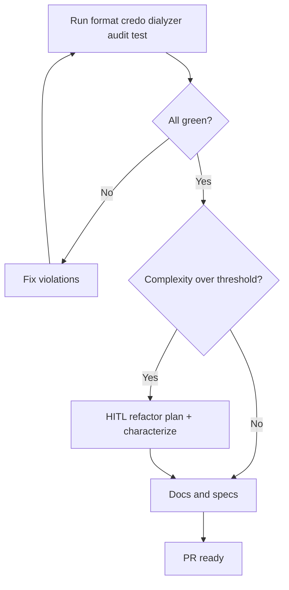

# Quality Playbook

## HARD-GATE

- All quality commands (`mix format --check-formatted`, `mix credo --strict`, `mix dialyzer`, `mix hex.audit`, `mix test`) must exit 0 before a PR is opened.
- Any refactor requires green characterization tests and explicit user approval.
- No gate may be skipped or declared green from simulated output.

## When to use

Before opening a PR or when asked for a full quality/production-readiness pass.

## Atomic skills this playbook loads

| Skill | Path | Role |
|-------|------|------|
| `code-quality` | `skills/code-quality/` | Complexity/duplication |
| `credo-config` | `skills/credo-config/` | Credo setup |
| `refactor-code` | `skills/refactor-code/` | Safe extractions |
| `typespec-dialyzer` | `skills/typespec-dialyzer/` | Specs/docs types |

## Flow



## Complexity thresholds (Phase 2 trigger)

| Metric | Threshold |
|--------|-----------|
| Function length | > 20 lines |
| Parameters | > 4 |
| Module length | > 400 lines |
| Nesting | > 3 |
| Pipe chain | > 5 |

## Agent Phases

### Phase 1 — Conventions

```bash
mix format --check-formatted
mix credo --strict
mix dialyzer
mix hex.audit
mix test
```

**HARD GATE — Quality commands exit 0:**

- [ ] `mix format --check-formatted` exits 0.
- [ ] `mix credo --strict` exits 0.
- [ ] `mix dialyzer` exits 0.
- [ ] `mix hex.audit` exits 0.
- [ ] `mix test` exits 0.

**If gate fails:** Fix the reported violations and re-run the quality commands before continuing.

### Phase 2 — Refactor (optional)

Only if thresholds exceeded.

1. Characterization test (must be green on current code).
2. **HUMAN-IN-THE-LOOP:** propose one extraction at a time; wait for approval.
3. Apply one change; re-run tests.
4. Prefer FCIS extractions (pure modules out of LiveViews/controllers/workers).

**HARD GATE — Refactor green tests and user approval:**

- [ ] A characterization test exists and passes on the current code.
- [ ] User approves each extraction before it is applied.
- [ ] Tests remain green after each change.

**If gate fails:** Revert the last change and take a smaller extraction step.

### Phase 3 — Documentation

- `@doc` + `@spec` on public APIs touched
- No PR until docs + Phase 1 gate hold

**HARD GATE — No simulated green gates:**

- [ ] Public APIs touched have `@doc` and `@spec`.
- [ ] No gate is skipped or declared green from simulated output.

**If gate fails:** Add missing docs/specs or re-run the actual quality commands.

## Verification checklist

- [ ] Format / Credo / Dialyzer / audit / test green
- [ ] Refactors (if any) HITL-approved and characterized
- [ ] Public APIs documented
- [ ] No FCIS violations introduced (fat edges)

## Error Recovery

Fix failing tool first; never open PR with a red gate.

## Output Style

```markdown
## Quality Report

**Scope:** `<branch or PR>`
**Quality command results:**
| Command | Exit | Notes |
|---------|------|-------|
| `mix format --check-formatted` | 0 / non-zero | |
| `mix credo --strict` | 0 / non-zero | |
| `mix dialyzer` | 0 / non-zero | |
| `mix hex.audit` | 0 / non-zero | |
| `mix test` | 0 / non-zero | |

**HARD-GATE results:**
- Quality commands exit 0: PASS / FAIL
- Refactor green tests and user approval: PASS / FAIL (N/A if no refactor)
- No simulated green gates: PASS / FAIL

**Refactors applied:** <list with file:line>
**Docs/specs added:** <list>
**Verdict:** APPROVE / REQUEST_CHANGES
```
