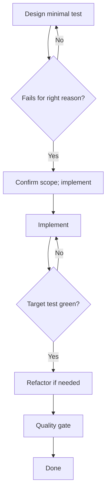

# TDD Playbook

## HARD-GATE

- No implementation code is written until a test exists, is run, and fails for the right reason (missing behaviour, not syntax/config).
- Implement within the user-authorized scope; ask only when a material scope decision or an unauthorized external action is required.
- Refactoring preserves behaviour and keeps target tests green.
- The quality gate (`mix format --check-formatted`, `mix credo --strict`, `mix dialyzer`, `mix test`) must pass before opening a PR.

## When to use

Building or changing Elixir behaviour where tests must gate implementation. Prefer pure-core unit tests first (FCIS); use DataCase only when persistence is the behaviour under test.

## Atomic skills this playbook loads

| Skill | Path | Role |
|-------|------|------|
| `testing-essentials` | `skills/testing-essentials/` | ExUnit patterns, fixtures |
| `elixir-essentials` | `skills/elixir-essentials/` | FCIS language rules |
| `typespec-dialyzer` | `skills/typespec-dialyzer/` | `@spec` on public APIs |

Do **not** re-teach LiveView/Ecto here — load domain atomics when the feature needs them.

## Flow



## Agent Phases

### Phase 1 — Context and RED

1. Decide test type (unit / DataCase / LiveView) and boundary.
2. Write the **minimal** failing test.
3. Run: `mix test path/to/file_test.exs`

**HARD GATE — Test fails for right reason:**

- [ ] The test exists and was run.
- [ ] The test fails because behaviour is missing (e.g. `UndefinedFunctionError`), not syntax/config.

**If gate fails:** Fix the test setup until the failure reason is correct. Do not implement yet.

### Phase 2 — Authorized implementation and GREEN

1. Propose the **minimal** implementation (no extra features).
2. Verify that the minimal implementation fits the authorized task. Continue without repeating approval; ask only for unresolved scope or an unauthorized external action.
3. Implement the smallest change satisfying the authorized acceptance criteria.
4. Run: `mix test path/to/file_test.exs` — must pass.

**HARD GATE — Authorized scope:**

- [ ] The request or prior decision authorizing this scope is recorded.
- [ ] Target test is green and no new failures were introduced.

**If gate fails:** Resolve the material scope question; continue independent authorized work.

### Phase 3 — Refactor

1. Refactor for clarity only (behaviour unchanged).
2. Re-run target tests after each step.
3. Repeat Phase 1–3 for the next behaviour slice.

**HARD GATE — Refactor target tests green:**

- [ ] Refactoring does not change behaviour; target tests remain green.

**If gate fails:** Revert the last refactor and take a smaller step.

### Phase 4 — Quality gate

```bash
mix format --check-formatted
mix credo --strict
mix dialyzer
mix test
```

Add `@doc` / `@spec` on new public APIs. Self-review the branch diff (or run `code-review` playbook) before opening a PR.

**HARD GATE — Quality gate green:**

- [ ] `mix format --check-formatted`, `mix credo --strict`, `mix dialyzer`, and `mix test` all exit 0.
- [ ] New public APIs have `@doc` and `@spec`.

**If gate fails:** Fix formatting, Credo, Dialyzer, or test failures before opening a PR.

## Verification checklist

- [ ] Failing test observed for the right reason before impl
- [ ] Minimal implementation matches authorized scope
- [ ] Target tests green after impl and after each refactor
- [ ] Quality commands green
- [ ] Public APIs documented

## Error Recovery

| Problem | Action |
|---------|--------|
| Wrong-reason fail | Fix test/config; stay in Phase 1 |
| Impl still red | Diagnose; re-propose if approach changes (ask only if scope changes) |
| Refactor turns red | Revert last step; smaller extraction |
| Quality red | Fix before PR; do not skip gates |

## Output Style

```markdown
## TDD Report

**Feature:** <behaviour under test>
**Test file:** `path/to/file_test.exs`
**HARD-GATE results:**
- Test fails for right reason: PASS / FAIL
- Authorized scope: PASS / FAIL
- Quality gate green: PASS / FAIL

**Commands run:**
| Command | Exit | Notes |
|---------|------|-------|
| `mix test path/to/file_test.exs` (RED) | non-zero / unexpected | |
| `mix test path/to/file_test.exs` (GREEN) | 0 / non-zero | |
| `mix format --check-formatted` | 0 / non-zero | |
| `mix credo --strict` | 0 / non-zero | |
| `mix dialyzer` | 0 / non-zero | |
| `mix test` | 0 / non-zero | |

**Refactor steps:** <list>
**Public API docs/specs:** <list>
**Verdict:** APPROVE / REQUEST_CHANGES
```
